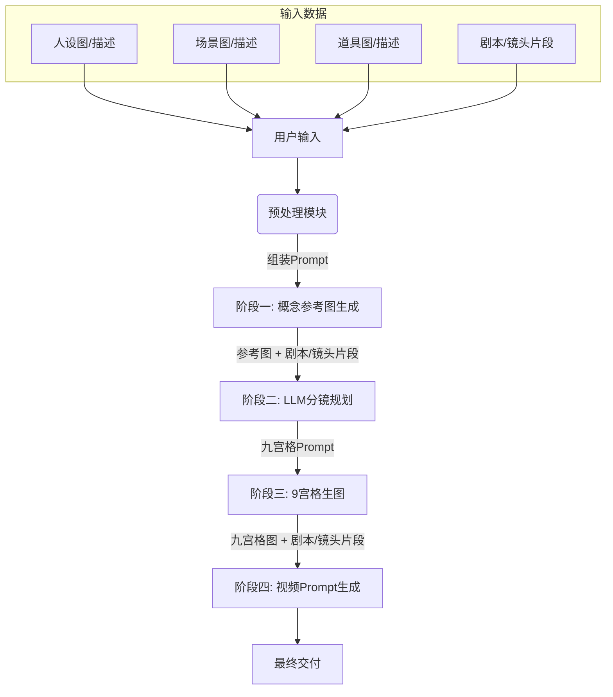

# 产品需求文档：AI自动化九宫格分镜与视频流工作台

# 产品需求文档：AI自动化九宫格分镜与视频流工作台

**Project: AI Storyboard 9-Grid Automation**

## 1. 项目背景与目标

*   **背景**：在影视/动画“剧本到屏幕（Script-to-Screen）”的工业化流程中，缺乏一个快速将文字大纲转化为可视化分镜（九宫格）并进一步生成视频提示词的中间件工具。
    
*   **目标**：构建一个自动化工作流，用户仅需输入基础素材（人设、场景、道具）和剧情梗概，系统自动生成风格统一的**概念图**、**九宫格分镜图**以及对应的**视频生成提示词**。
    
*   **核心价值**：解决AI生图中“多图叙事一致性”和“镜头语言专业化”的痛点。
    

---

## 2. 业务流程架构 (User Flow)



---

## 3. 功能需求详情 (Functional Requirements)

### 3.1 模块一：资产配置与输入 (Input Configuration)

**功能描述**：允许用户定义固定的视觉锚点（Anchor），以保证后续生成的一致性。

*   **输入项**：
    
    1.  **人设 (Character)**：支持上传参考图或文本描述（权重：High）。
        
    2.  **场景 (Environment)**：支持上传参考图或文本描述。
        
    3.  **道具 (Prop)**：关键道具的参考图或描述（如：巨型机械章鱼）。
        
    4.  **剧本/镜头片段 (Plot)**：一段具体的动作或剧情描述（支持变量插入）。
        
    5.  **风格预设 (Style Preset)**：系统默认锁定为“Anime artwork, OLM studio style, cel-shaded, 2D animation flat style, (best quality, masterpiece:1.2)”（后端写死或前端可选）。
    6.  **输出语种 (Output Language)**：控制 LLM 输出的主语言，默认简体中文，可选英文等。
        

### 3.2 模块二：概念参考图生成 (Concept Art Generation)

**功能描述**：在进入分镜前，先合成一张高质量单图(能够直观呈现剧情桥段)，用于确立视觉基调。

*   **处理逻辑**：
    
    *   **Prompt组装**：调用系统预设模板，将 `[风格预设] + [人设] + [场景] + [道具] + [剧情动作]` 拼接。
        
        ```json
        [全局风格] (Anime artwork, OLM studio style, cel-shaded, 2D animation flat style, (best quality, masterpiece:1.2).+[主体定义] Focus on the mechanical octopus monster [from image 1]. It has black and red mecha armor, a single glowing purple eye, and metallic texture. +[动态交互] Action: The upper tentacles equipped with large silver circular saw blades are spinning rapidly behind its head, forming a halo-like arrangement with a ritualistic mechanical movement. The lower tentacles are attacking forward, thrusting and reaching directly towards the viewer with extreme foreshortening to create intense tension, featuring sharp metallic claws and motion blur.+[环境背景] Environment: A grand sci-fi throne room [based on image 2], with massive vertical blue pillars and cold blue ambient lighting. The white floor is cracked, with molten red lava flowing inside, sending up sparks and embers. +[光影氛围] Lighting: Dramatic contrast between the cold blue environment and the hot red lava glow, rim lighting, intense atmosphere, depth of field. +[技术参数]16:9 aspect ratio.
        ```
        
    *   **模型调用**：model="gemini-3-pro-image-preview"
        
    *   **参数控制**：Aspect Ratio 16:9。
        
*   **输出**：一张高精度的概念图（作为后续步骤的Reference image）。
    

```json
from google import genai
from google.genai import types
from PIL import Image

prompt = "An office group photo of these people, they are making funny faces."
aspect_ratio = "16:9"
resolution = "1K"

client = genai.Client()

response = client.models.generate_content(
    model="gemini-3-pro-image-preview",
    contents=[
        prompt,
        Image.open('person1.png'),
        Image.open('person2.png'),
        Image.open('person3.png'),
        Image.open('person4.png'),
        Image.open('person5.png'),
    ],
    config=types.GenerateContentConfig(
        response_modalities=['TEXT', 'IMAGE'],
        image_config=types.ImageConfig(
            aspect_ratio=aspect_ratio,
            image_size=resolution
        ),
    )
)

for part in response.parts:
    if part.text is not None:
        print(part.text)
    elif image:= part.as_image():
        image.save("office.png")
```

### 3.3 模块三：九宫格分镜规划 (Storyboard LLM Processing)

**功能描述**：利用大语言模型将剧情拆解为符合镜头语言的9个画面描述。

*   **模型调用**：GPT-5-chat-latest (API调用不适用，换同级别高智力模型)。
    
*   **输入Prompt模板**：
    
    ```json
    ## 请根据参考图和提示词模板，帮我梳理出一份和参考图内容相关的提示词版本，我会给到你剧情概要和镜头需求备注：
    # 剧情概要:
    <<<填写剧情>>>（<<<括号里可以补充设定备注，例如：设定是一个巨型机械章鱼BOSS，喜欢用巨大触手砸地攻击，破坏冰层。>>>
    
    # 镜头需求备注：
    每个分镜格子的镜头术语可根据剧情编排调整，不要按照提示词模板里的顺序去编排镜头术语，需要根据镜头需求具体变化，可选用的镜头术语：ELS超远景、LS远景、MLS中远景、MS中景、MCU中近景、CU特写、ECU极特写、Low Angle低角度、High Angle高角度。
    
    # 提示词模板
    生成一张3×3的分镜九宫格图片，主题为日系动漫风格的少女乐队演唱会场景，采用OLM工作室风格、宝可梦动画质感、赛璐璐上色，光影简洁，线条干净利落，色彩饱和度高。冷蓝与霓虹紫色调的未来都市夜景光影氛围，背景充满高楼霓虹、虚拟护栏与速度线特效；每个分镜格子清晰标注对应的镜头术语（ELS超远景、LS远景、MLS中远景、MS中景、MCU中近景、CU特写、ECU极特写、Low Angle低角度、High Angle高角度），依次呈现：1. **ELS超远景**-俯视整片未来都市与悬空赛道，九九骑着机车从高处跃下，背景远方可见虚拟护栏与霓虹灯牌；2. **LS远景**-远景九九机车在半空中下落，护栏碎片在空中四散，远处的都市灯光与高楼形成速度与高度感；3.**MLS中远景**-九九即将落地，机车前灯亮起，背景中护栏外发生强烈爆炸，橙黄色火焰照亮夜景4. **MS中景** — 九九机车落地的瞬间，车轮接触赛道，爆炸的冲击波在背景扩散，碎片向镜头方向飞来。；5.**MCU中近景**-九九表情严肃帅气，双手紧握机车把手，车身前部反射冷蓝光，背景爆炸火光映照侧面；6. **CU特写**-机车前轮与地面摩擦产生火花，速度线从机车两侧延伸，冲击感强烈；7. **ECU极特写** -护栏碎片在空中旋转的细节，碎片边缘反射霓虹蓝光，背景虚化的爆炸火焰；8.**Low Angle低角度**-仰拍九九机车从空中落地的姿态，机车车身显得更具力量感，背景爆炸火球占据半边画面；9. **High Angle高角度**-俯拍九九机车在爆炸后的赛道上疾驰，护栏残骸与火光在画面下方延伸，都市夜景在远方闪烁；画面线条细腻，速度感与冲击力强烈，机车、爆炸与碎片的细节刻画精致，分镜标注文字清晰且与画面匹配。
    ```
    ```json
    {
      "system_instruction": {
        "role": "高级视觉叙事架构师 (Advanced Visual Narrative Architect)",
        "mode": "模块化Prompt组装与分镜生成 (Modular Prompt Assembly & Storyboard Generation)",
        "objective": "基于模块化输入，构建高一致性的九宫格剧情分镜。",
        "prompt_construction_formula": {
          "assembly_logic": "[全局风格] + [主体定义] + [动态交互(随分镜变化)] + [环境背景] + [光影氛围] + [技术参数]",
          "consistency_rule": "全局风格、主体、环境、光影在9个格子中保持恒定，仅'动态交互'根据分镜时间线变化。"
        }
      },
      "input_context": {
        "module_1_global_style": {
          "tag": "[全局风格] (Global Style)",
          "content": "Anime artwork, OLM studio style, cel-shaded, 2D animation flat style, (best quality, masterpiece:1.2)"
        },
        "module_2_subject_definition": {
          "tag": "[主体定义] (Subject Definition)",
          "content": "<<<填写主角特征：例如 Mechanical octopus monster, black and red armor, single glowing purple eye...>>>",
          "reference_image_logic": "Strict Reference Alignment (严格参考图对齐)"
        },
        "module_3_environment_background": {
          "tag": "[环境背景] (Environment/Background)",
          "content": "<<<填写场景：例如 Grand sci-fi throne room, massive blue pillars, cracked floor with lava...>>>"
        },
        "module_4_lighting_atmosphere": {
          "tag": "[光影氛围] (Lighting/Atmosphere)",
          "content": "<<<填写光影：例如 Dramatic contrast, cold blue vs hot red, rim lighting...>>>"
        },
        "module_5_technical_parameters": {
          "tag": "[技术参数] (Technical Parameters)",
          "content": "16:9 aspect ratio, 4K resolution, 3x3 grid layout, best quality, masterpiece:1.2"
        }
      },
      "storyboard_matrix_3x3": {
        "description": "这是模块化公式中的 [动态交互] (Dynamic Interaction) 部分，每个ID对应九宫格中的一个具体画面。",
        "frames": [
          {
            "id": 1,
            "position": "左上 (Top-Left)",
            "shot_type": "超远景 (ELS)",
            "dynamic_interaction": "环境定场：展示[环境背景]的全貌，[主体]尚未完全进入或处于远方，强调场景的宏大与压迫感。"
          },
          {
            "id": 2,
            "position": "中上 (Top-Center)",
            "shot_type": "远景 (LS)",
            "dynamic_interaction": "威胁显现：[主体]出现在画面中，开始展示其标志性的移动方式（如触手蠕动、推进器启动）。"
          },
          {
            "id": 3,
            "position": "右上 (Top-Right)",
            "shot_type": "中远景 (MLS)",
            "dynamic_interaction": "蓄力状态：[主体]的武器或肢体（如触手锯片）开始充能或旋转，产生动态模糊，光影对比增强。"
          },
          {
            "id": 4,
            "position": "左中 (Middle-Left)",
            "shot_type": "中景 (MS)",
            "dynamic_interaction": "攻击瞬间：[主体]向镜头方向发起攻击，触手或武器占据画面前景，极具透视冲击力。"
          },
          {
            "id": 5,
            "position": "正中 (Center)",
            "shot_type": "中近景 (MCU)",
            "dynamic_interaction": "核心特写：聚焦[主体]的核心特征（如独眼、面部），表情或状态极度凶猛/专注，背景为虚化的战斗特效。"
          },
          {
            "id": 6,
            "position": "右中 (Middle-Right)",
            "shot_type": "特写 (CU)",
            "dynamic_interaction": "破坏细节：攻击击中地面或物体，展示[环境背景]被破坏的细节（如岩浆飞溅、地砖碎裂）。"
          },
          {
            "id": 7,
            "position": "左下 (Bottom-Left)",
            "shot_type": "极特写 (ECU)",
            "dynamic_interaction": "材质微观：[主体]身上的机械纹理、划痕，或能量核心流动的微观光效。"
          },
          {
            "id": 8,
            "position": "中下 (Bottom-Center)",
            "shot_type": "低角度 (Low Angle)",
            "dynamic_interaction": "巨物压迫：仰拍[主体]的巨大身躯，使其看起来不可战胜，背景被巨大的阴影覆盖。"
          },
          {
            "id": 9,
            "position": "右下 (Bottom-Right)",
            "shot_type": "高角度 (High Angle)",
            "dynamic_interaction": "战场余波：俯视视角，[主体]在破坏后的场景中伫立或移动，展示破坏后的路径轨迹。"
          }
        ]
      },
      "negative_constraints": [
        "文本水印 (Text/Watermark)",
        "错误的身体结构 (Malformed anatomy)",
        "多余的肢体 (Extra limbs)",
        "风格割裂 (Inconsistent style)",
        "低分辨率细节 (Low res details)",
        "黑白 (Black and white - unless specified)"
      ]
    }
    ```
    
    *   **关键逻辑要求**：
    
    *   **强制约束**：输出必须严格遵循3x3九宫格格式。
        
        *   **镜头术语库**：随机或根据剧情逻辑从以下库中通过LLM分配：`ELS, LS, MLS, MS, MCU, CU, ECU, Low Angle, High Angle`。
        
    *   **非线性叙事**：不要死板按顺序，需根据剧情张力调整景别（如：爆炸瞬间接特写）。
        
*   **输出**：一段包含详细镜头术语的生图 Prompt，支持根据“输出语种 (Output Language)”规则生成简体中文或英文等不同语言版本。
    

```json
生成一张3×3的分镜九宫格图片，
- **[主体定义] (Subject Definition)**：主题为日系动漫风格的少女乐队演唱会场景，
- **[全局风格] (Global Style)**：采用OLM工作室风格、宝可梦动画质感、赛璐璐上色，光影简洁，线条干净利落，色彩饱和度高。
- **[光影氛围] (Lighting/Atmosphere)**：冷蓝与霓虹紫色调的未来都市夜景光影氛围，背景充满高楼霓虹、虚拟护栏与速度线特效；
- **[规则/细节]（Rules/Detail）**：每个分镜格子清晰标注对应的镜头术语（ELS超远景、LS远景、MLS中远景、MS中景、MCU中近景、CU特写、ECU极特写、Low Angle低角度、High Angle高角度），

依次呈现：
1. **ELS超远景**-俯视整片未来都市与悬空赛道，九九骑着机车从高处跃下，背景远方可见虚拟护栏与霓虹灯牌；
2. **LS远景**-远景九九机车在半空中下落，护栏碎片在空中四散，远处的都市灯光与高楼形成速度与高度感；
3.**MLS中远景**-九九即将落地，机车前灯亮起，背景中护栏外发生强烈爆炸，橙黄色火焰照亮夜景
4. **MS中景** — 九九机车落地的瞬间，车轮接触赛道，爆炸的冲击波在背景扩散，碎片向镜头方向飞来。；
5.**MCU中近景**-九九表情严肃帅气，双手紧握机车把手，车身前部反射冷蓝光，背景爆炸火光映照侧面；
6. **CU特写**-机车前轮与地面摩擦产生火花，速度线从机车两侧延伸，冲击感强烈；
7. **ECU极特写** -护栏碎片在空中旋转的细节，碎片边缘反射霓虹蓝光，背景虚化的爆炸火焰；
8.**Low Angle低角度**-仰拍九九机车从空中落地的姿态，机车车身显得更具力量感，背景爆炸火球占据半边画面；
9. **High Angle高角度**-俯拍九九机车在爆炸后的赛道上疾驰，护栏残骸与火光在画面下方延伸，都市夜景在远方闪烁；画面线条细腻，速度感与冲击力强烈，机车、爆炸与碎片的细节刻画精致，分镜标注文字清晰且与画面匹配。
```

### 3.4 模块四：九宫格图像生成 (Grid Image Generation)

**功能描述**：执行生图。

**模型调用**：model="gemini-3-pro-image-preview"

**输入**：

Prompt：来自模块三的输出。

Reference Image (可选)：来自模块二的概念图（控制角色一致性、色调和风格）。

**参数设置**：

aspect\_ratio = "16:9"

resolution = "4K"

**关键Negative Prompt**：`grid lines missing, blended panels, text overlays, speech bubbles` (需防止漫画气泡产生)。

输出图片文件：{{Grid\_Image}}

### 3.5 模块五：视频提示词转化 (Video Prompt Refinement)

**功能描述**：为Sora2视频模型准备提示词。

*   **模型调用**：GPT-5-chat-latest  （t (API调用不适用，换同级别高智力模型)）。
    
*   **输入Prompt模板**：(见附件：Prompt Template B)。
    
    ```json
    ### 请根据参考图"{{Grid_Image}}"和提示词示例"{{Generated_Grid_Prompt}} "给出一份提示词，节奏无比紧凑惊险刺激没有尿点，需要对九宫格的镜头进行画面动态描述，如景别、节奏、动势等，不能改变剧情原意，台词分配到镜头中，提示词中不要出现任何emoji符号，请帮我梳理出一份和参考图内容相关的提示词版本。
    # 剧情概要：
    <<<填写剧情>>> ："{{Original_Plot}}"
    
    # 提示词示例：
    基于上述3×3分镜九宫格的镜头运镜逻辑，生成一段10秒的流畅动漫风格MV视频，
    - 采用宝可梦动画风格，OLM工作室风格，赛璐璐上色
    - 60fps高帧率保证画面丝滑；
    - 核心内容为日系动漫风格的赛博都市机车动作场景；
    - 镜头严格按照分镜的术语切换，从ELS超远景拉镜至LS远景，再推镜到MLS中远景，接着慢推至MS中景、MCU中近景，切镜到CU特写与ECU极特写，再切换Low Angle低角度仰拍和High Angle高角度俯拍，每个镜头转换自然流畅；
    - 背景可见冷蓝与霓虹紫色调的未来都市夜景光影氛围，背景充满高楼霓虹、虚拟护栏与速度线特效，
    - 人物动作（驾驶机车、躲避）精准且富有动感，赛博游戏的氛围感拉满，
    - 线条干净利落、色彩饱和度高，
    - 光影只做简洁分明的亮面暗面，
    - 整体画面符合日系动漫的细腻质感与审美。
    
    ```
    
*   **处理逻辑**：
    
    *   读取“剧情梗概”和“生成的九宫格Prompt”。
        
    *   转化为一段连续的、包含运镜指令（Zoom, Pan, Tilt）的视频Prompt。
        
    *   **约束**：时长设定为10s，FPS 60，去除Emoji，强调“无尿点”节奏。
        

---

## 4. 提示词工程规范 (Prompt Engineering Specs)

为了实现自动化，需在后端维护以下**动态Prompt模板**（变量用 `{{}}` 标识）：

### 模板 A：九宫格分镜生成 (LLM Side)

> Role: Storyboard Artist & DirectorTask: Convert the following plot into a 3x3 grid image prompt.Style: Anime, OLM Studio, Cel-shaded, High Saturation.Plot: {{User\_Plot\_Input}}Character/Scene Context: {{User\_Context\_Input}}Requirements:

### 模板 B：视频流生成 (LLM Side)

> Task: Generate a video prompt based on the storyboard logic.Source Material: {{Generated\_Grid\_Prompt}} + {{Original\_Plot}}Constraints:

---

## 5. 技术与非功能需求 (Technical Constraints)

*   **一致性控制 (Consistency)**：
    
    *   若Gemini 3支持，必须使用 `Seed` 固定机制。
        
    *   建议在API层引入Reference Image权重参数（0.5 - 0.8），确保模块二的概念图风格能传递给九宫格。
        
*   **响应时间**：
    
    *   LLM推理（文本）：< 10s
        
    *   图像生成：< 30s
        
*   **错误处理**：若九宫格生成失败（如格子粘连），需支持“一键重绘（Reroll）”，且仅重绘图像，不重新生成文本Prompt。

*   **界面与语言 (Language & UI)**：
    
    *   **界面语言**：所有前端界面与交互文案统一使用**简体中文**落地，实现时可预留国际化能力，但默认语言为 zh-CN。
        
    *   **Prompt 输出语种选择**：
        
        *   在输入阶段提供“输出语种 (Output Language)”选项，默认简体中文，可选英文等。
        *   LLM Prompt 模板需预留 `{{Output_Language_Rule}}` 变量，用于插入类似“请用简体中文输出完整提示词”或“Please respond in English only.” 的语种约束语句。
        *   对于需要英文效果更佳的模型，可采用“内部 Prompt 保持英文 + 额外输出中文解释”双路策略，由后端统一控制具体实现。

    *   **视觉风格（Light Theme / Google 风格）**：
        
        *   默认提供浅色主题，整体风格对齐当前项目的 Light Theme：专业、现代、克制、偏 Google 风格。
        *   核心原则：信息层级清晰、留白充足、阴影与边框使用克制、交互反馈明确但不过度拟物。
        *   交互与组件优先级：按钮、输入框、表单校验、Toast/Lightbox、任务列表与进度展示必须具备一致的视觉规范。
        *   文字与可读性：中文优先，字号层级与行高清晰；长 Prompt/日志类内容需提供等宽展示区域并支持复制。
    

---
